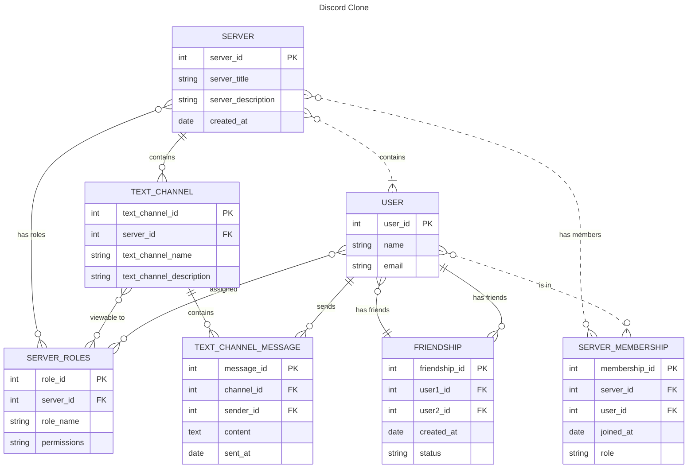

```mermaid
---
title: Discord Clone
---
erDiagram
    SERVER }o..|{ USER : contains
    SERVER }o--o{ SERVER_ROLES : "has roles"
    SERVER ||--o{ TEXT_CHANNEL : contains
    TEXT_CHANNEL }o--o{ SERVER_ROLES : "viewable to"
    USER }o--o{ SERVER_ROLES : assigned
    TEXT_CHANNEL ||--o{ TEXT_CHANNEL_MESSAGE : contains
    USER ||--o{ TEXT_CHANNEL_MESSAGE : sends
    FRIENDSHIP }o--|| USER : "has friends"
    USER }o--|| FRIENDSHIP : "has friends"
    SERVER }o..o{ SERVER_MEMBERSHIP : "has members"
    USER }o..o{ SERVER_MEMBERSHIP : "is in"

    SERVER_MEMBERSHIP {
        int membership_id PK
        int server_id FK
        int user_id FK
        date joined_at
        string role
    }


    SERVER {
        int server_id PK
        string server_title
        string server_description
        date created_at
    }

    USER {
        int user_id PK
        string name
        string email
    }

    FRIENDSHIP {
        int friendship_id PK
        int user1_id FK
        int user2_id FK
        date created_at
        string status
    }

    TEXT_CHANNEL {
        int text_channel_id PK
        int server_id FK
        string text_channel_name
        string text_channel_description
    }

    SERVER_ROLES {
        int role_id PK
        int server_id FK
        string role_name
        string permissions
    }

    TEXT_CHANNEL_MESSAGE {
        int message_id PK
        int channel_id FK
        int sender_id FK
        text content
        date sent_at
    }
```
